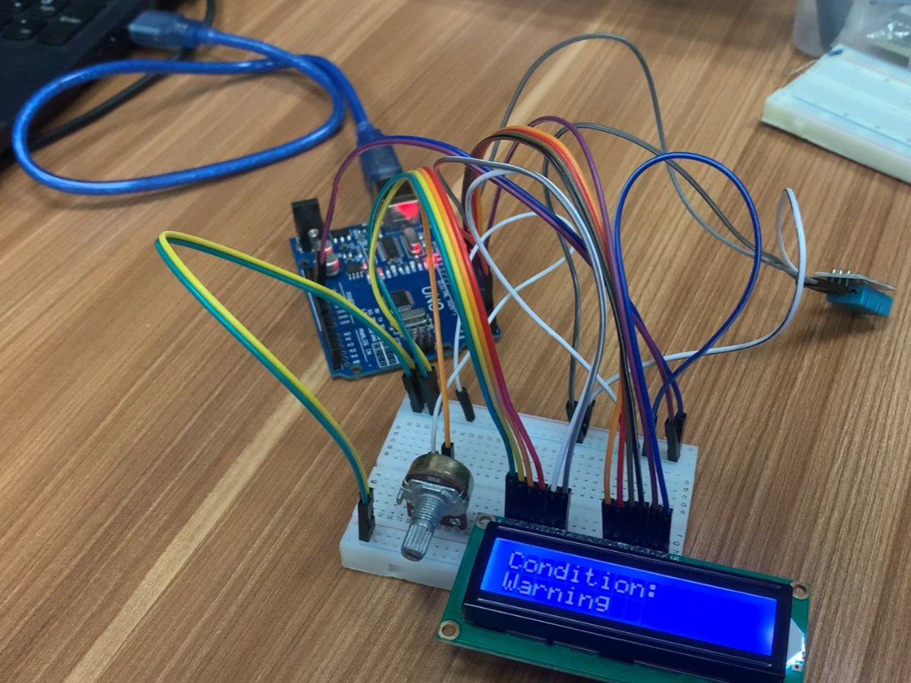
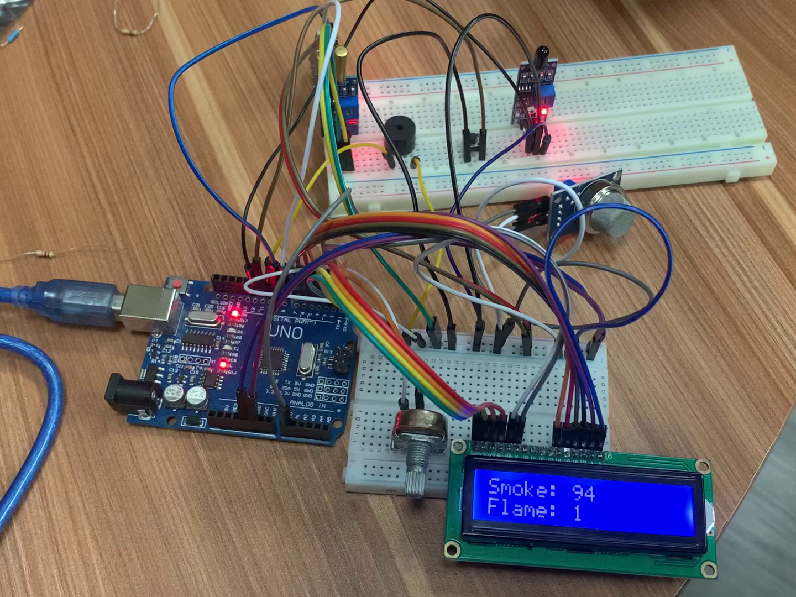
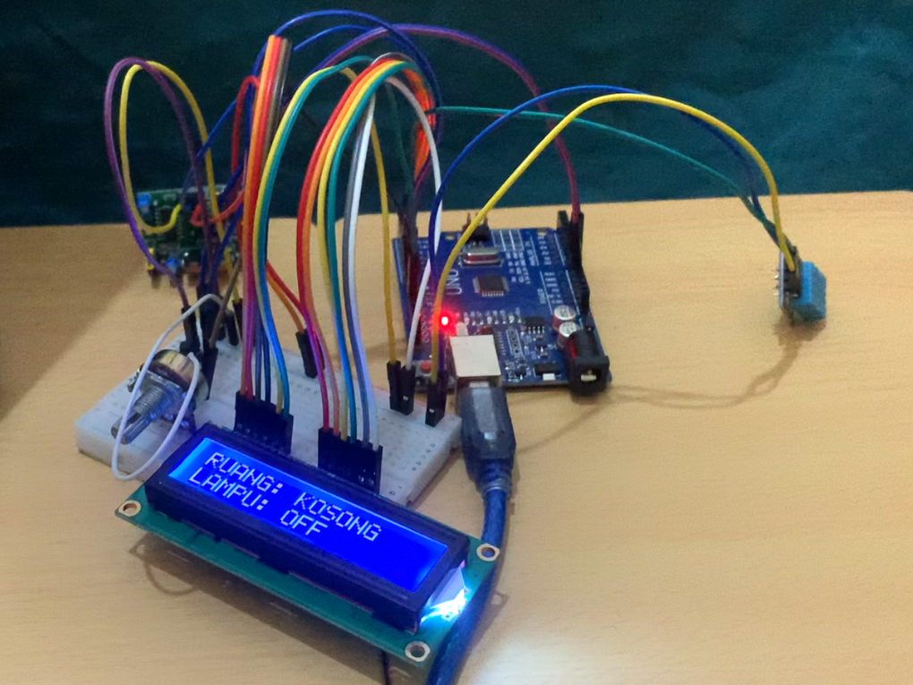

# Tugas Besar 3 IF3260 Pengembangan Aplikasi pada Platform Khusus
> Tugas Besar 3 IF3260 Pengembangan Aplikasi pada Platform Khusus - Arduino Projects

## Anggota Kelompok
<table>
    <tr>
        <td colspan="3", align = "center"><center>Nama Kelompok: IFEmbedded</center></td>
    </tr>
    <tr>
        <td>No.</td>
        <td>Nama</td>
        <td>NIM</td>
    </tr>
    <tr>
        <td>1.</td>
        <td>Bintang Hijriawan</td>
        <td>13521003</td>
    </tr>
    <tr>
        <td>2.</td>
        <td>Jason Rivalino</td>
        <td>13521008</td>
    </tr>
    <tr>
        <td>3.</td>
        <td>Muhammad Salman Hakim Alfarisi</td>
        <td>13521010</td>
    </tr>
    <tr>
        <td>4.</td>
        <td>M. Malik I. Baharsyah</td>
        <td>13521029</td>
    </tr>
</table>

## Table of Contents
* [Deskripsi Singkat](#deskripsi-singkat)
* [Struktur File](#struktur-file)
* [Gambar Rangkaian](#gambar-rangkaian)
* [Video Demo](#video-demo)
* [Acknowledgements](#acknowledgements)

## Deskripsi Singkat 
Pada pengerjaan Tugas Besar 3 ini, terdapat tiga dari empat proyek Arduino yang dikerjakan pada spesifikasi tugas. Proyek yang dikerjakan antara lain sebagai berikut:
1. Proyek 1 - Greenhouse Monitoring System: sistem pendeteksi suhu dan kelembapan dari suatu ruangan
2. Proyek 3 - Earthquake and Fire Monitoring System: sistem pendeteksi adanya gempa dan juga api
3. Proyek 2 - Classroom Monitoring System: sistem pendeteksi adanya mahasiswa dikelas untuk membantu menyalakan peralatan elektronik

## Struktur File
```
📦arduino_projects
 ┣ 📂docs
 ┃ ┗ 📜Arduino_Projects.pdf
 ┣ 📂img
 ┃ ┣ 📜Project1_Greenhouse.png
 ┃ ┣ 📜Project2_Classroom.png
 ┃ ┗ 📜Project3_EarthquakeFire.png
 ┣ 📂src
 ┃ ┣ 📂Project1_Greenhouse
 ┃ ┃ ┗ 📜Project1_Greenhouse.ino
 ┃ ┣ 📂Project2_Classroom
 ┃ ┃ ┗ 📜Project2_Classroom.ino
 ┃ ┣ 📂Project3_EarthquakeFire
 ┃ ┃ ┗ 📜Project3_EarthquakeFire.ino
 ┃ ┣ 📜Project1_Greenhouse.cpp
 ┃ ┣ 📜Project2_Classroom.cpp
 ┃ ┗ 📜Project3_EarthquakeFire.cpp
 ┗ 📜README.md
```

## Gambar Rangkaian
Rangkaian dari Proyek 1 - Greenhouse Monitoring System<br><br>

<br><br>
Rangkaian dari Proyek 3 - Earthquake and Fire Monitoring System<br><br>

<br><br>
Rangkaian dari Proyek 2 - Classroom Monitoring System<br><br>


## Video Demo
Untuk video demo, dapat diakses pada link berikut:<br>
- [Proyek 1 - Greenhouse Monitoring System](https://drive.google.com/file/d/1uTx2DEat7ewV-kEsYQTKva57vaRyaz-p/view?usp=drive_link)<br>
- [Proyek 3 - Earthquake and Fire Monitoring System](https://drive.google.com/file/d/1DTZ90-u0ZCSyecoqEX4bmLj5jbpZLCWr/view?usp=drive_link)<br>
- [Proyek 2 - Classroom Monitoring System](https://drive.google.com/file/d/10DwcWLylWrxZhUY167ViWxy3p_JRfXn2/view?usp=drive_link)

## Acknowledgements
- Tuhan Yang Maha Esa
- Dosen Mata Kuliah Pengembangan Aplikasi pada Platform Khusus IF3210
- Kakak-Kakak Asisten Mata Kuliah Pengembangan Aplikasi pada Platform Khusus IF3210
